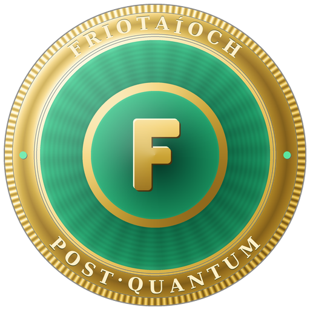

<p align="center"></p>

Friotaíoch (FRIO)
=================

A quantum-resistant cryptocurrency forked from Bitcoin Core.

Friotaíoch adds post-quantum digital signatures to a Bitcoin-derived chain, so
coins can be received and spent using signature schemes believed to resist
attacks by large-scale quantum computers. It introduces **Pay-to-Quantum-Resistant
(P2QR)** outputs backed by NIST-standardised signatures:

- **ML-DSA-65** (FIPS 204) — witness version 2 (`friort1z…` / `frio1z…`)
- **SPHINCS+-SHA2-128s** / SLH-DSA (FIPS 205) — witness version 3

Both schemes are validated against pinned upstream NIST known-answer vectors
(see `src/crypto/pq/CONFORMANCE.md`).

What it is
----------

Friotaíoch connects to the Friotaíoch peer-to-peer network to download and fully
validate blocks and transactions. It includes a wallet and an optional graphical
user interface. It is a fork of Bitcoin Core and retains that project's
architecture, consensus rules, and tooling except where changed for
post-quantum support and network identity.

Key parameters
--------------

| Property            | Value                                   |
|---------------------|-----------------------------------------|
| Ticker              | FRIO                                    |
| Proof of work       | SHA256d                                 |
| Difficulty          | ASERT (aserti3-2d), 10-minute blocks    |
| Supply cap          | 21,000,000 FRIO                         |
| Mainnet P2P port    | 51776                                    |
| Mainnet RPC port    | 51777                                    |
| Address HRP         | `frio` (mainnet), `tfrio` (testnet)     |
| PQ signatures       | ML-DSA-65 (v2), SPHINCS+-128s (v3)      |

Post-quantum features
----------------------

- P2QR consensus (`SCRIPT_VERIFY_PQR`), enforced from genesis.
- Native PQC wallet: generate P2QR addresses (`getnewpqraddress`), receive,
  persist, encrypt at rest, sign, and spend.
- Per-block PQC verification budget for denial-of-service protection.

Building
--------

Friotaíoch uses the same CMake build system as Bitcoin Core.

```sh
cmake -B build
cmake --build build -j"$(nproc)"
```

For the graphical wallet, install Qt6 and configure with the GUI enabled:

```sh
cmake -B build -DBUILD_GUI=ON
cmake --build build -j"$(nproc)" --target bitcoin-qt
```

Binaries are emitted as `friotaiochd`, `friotaioch-cli`, `friotaioch-qt`, etc.

Getting a new quantum-resistant address:

```sh
friotaioch-cli getnewpqraddress ""      # ML-DSA-65 (default, v2)
friotaioch-cli getnewpqraddress "" 3    # SPHINCS+-128s (v3)
```

License
-------

Friotaíoch is released under the terms of the MIT license. See [COPYING](COPYING)
for more information. It is a derivative work of Bitcoin Core; the copyright of
the upstream code remains with The Bitcoin Core developers, and modifications are
copyright The Friotaíoch developers.
